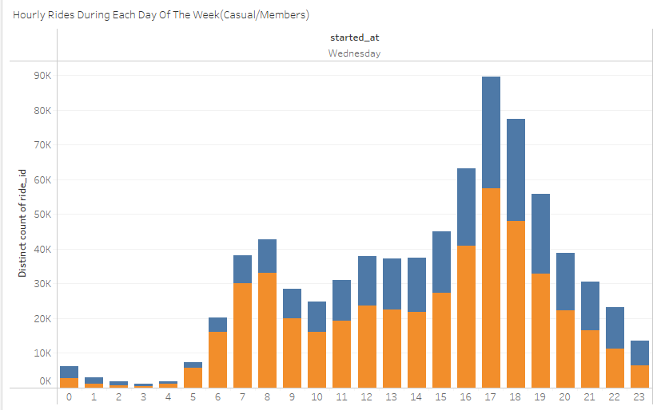

# Cyclist: Bike Sharing

---

# Data Analysis Using Sql & Tableau


## **Case Study**: Convert Casual Riders to Member Riders to make the Business more Profitable.

Over the last few weeks I have been working on Google Data Analytics Capstone from Coursera and this is my first Capstone Project. Below is my walkthrough to this case study using SQL, Tableau and different data analyst terminologies and processes.


# Scenario

My role is a Junior Data Analyst working in the marketing analyst team at Cyclistic, a bike-share company in Chicago. The director of marketing believes the company’s future success depends on maximizing the number of annual memberships. Therefore, my team wants to understand how casual riders and annual members use Cyclitic bikes differently. From these insights, my team will design a new marketing strategy to convert casual riders into annual members. But first, Cyclistic executives must approve my recommendations, so they must be backed up with compelling data insights and professional data visualizations.

I have used the six steps of the data analysis process learned throughout the 8 courses in the Google Data Analytics program to answer key business questions.

**Ask**, **prepare**, **process**, **analyze**, **share**, and **act**.


## Ask - Understand the problem

In this step, I asked myself the following questions to guide my analysis:


1. How do annual members and casual riders use Cyclistic bikes differently?
2. Why would casual riders buy Cyclistic annual memberships?
3. How can Digital Media/Marketing Influence Casual Riders To Become Member Riders?


## Prepare - What do I need?

The company provides the historical trip data for us to analyze and identify trends. This data set is publicly available by Motivate International Inc. and is downloadable from [s3 bucket in aws](https://divvy-tripdata.s3.amazonaws.com/index.html).

I decided to use the data sets of 12 months for the year 2021. This data set was arranged into 12 monthly separated files in CSV format and contained 4.9M+ data rows altogether.

The data contained the following fields:


* ride_id: Id for each ride taken
* rideable_type: Represents the type of a bike
* started_at: Date and time of the start time
* ended_at: Date and time of the end time
* start_station_name: Name of the starting station
* start_station_id: Id of the starting station
* end_station_name: Name of the ending station
* end_station_id: Id of the ending station
* start_lat: Latitude of the starting point
* start_lng: Longitude of the starting point
* end_lat: Latitude of the ending point
* end_lng: Longitude of the ending point
* member_casual: Represents the membership status

There were some inconsistencies within the data which needed to be addressed before we start the analysis. Multiple field values were null and these needed further inspection to understand the usage and how to minimize them.

**ROCCC Analysis**


* Reliable – Yes, not biased, the data is cleaned, given by the certificate course
* Original- Yes, can locate the original public data
* Comprehensive – No, not all ride data were complete
* Current – Yes
* Cited – Yes


## Process - Make it usable

I downloaded the previous 12 months of Cyclistic trip data (for year 2021) which was separated by month and zipped individually.

In the process of cleaning the data, my first step was to unzip the files and import  and combine all the 12 data sets into a single SQL Table. I started with using the Import Wizard in MySQL Workbench but that was very slow for the given huge dataset, so I had to find another way to import the CSVs. Also, while running the Import Wizard, I saw multiple errors complaining about duplicate entries in the primary key _ride_id_.

I went forward with the following query for each csv which was in comparison very fast to the Import Wizard (within minutes):

**Importing Data to SQL**


```
LOAD DATA INFILE 'C:/ProgramData/MySQL/MySQL Server 8.0/Uploads/tripdata/202112-divvy-tripdata.csv' 
INTO TABLE tripdata 
FIELDS TERMINATED BY ',' 
LINES TERMINATED BY '\n'
IGNORE 1 ROWS
(ride_id,rideable_type,started_at,ended_at,start_station_name,start_station_id,end_station_name,end_station_id,start_lat,start_lng,@end_lat,@end_lng,member_casual)
SET end_lat = IF(@end_lat = '', NULL, @end_lat), end_lng = IF(@end_lng = '', NULL, @end_lng);
```


While importing, I had to provide some defaults to empty fields which can be seen in the last line of the query. The process also eliminated the duplicate entries while importing due to the primary key providing a unique constraint. I quickly verified there are no duplicates by running the following query:


```
SELECT COUNT(ride_id) as total_count, COUNT(DISTINCT ride_id) as distinct_count from tripdata;
```


Next, I removed the data sets where there was no end station location information as these were evidently the maintenance cycle unlocks made by the company itself.


```
DELETE from tripdata AS t1 INNER JOIN tripdata as t2 where end_station_id IS NULL;
```


After that, I created additional columns to be able to more concretely analyze the riders usage patterns.


1. _ride_duration_: To calculate how long it took the rider to complete the trip from start to end station.
2. _ride_month_: To calculate in which month the riders took the maximum number of rides.


```
UPDATE tripdata as t1 inner join tripdata as t2
on t1.ride_id = t2.ride_id
SET t1.ride_duration = TIMESTAMPDIFF(SECOND, t2.started_at, t2.ended_at);

UPDATE tripdata as t1 inner join tripdata as t2
on t1.ride_id = t2.ride_id
SET t1.ride_month = monthname(t2.started_at);
```


I used Inner Joins to increase the query performance, so you read from one table and you right in another table to avoid table locks while executing the query.

Other calculations I knew I could do easily within Tableau during the visualization process. At this point, I knew I had a clean and complete data set to begin my analysis.


## Analyze - Telling the story


### Bike Type Usage


#### Most selected bike types by Casual and Member riders


<table>
  <tr>
   <td>


<p>
<em>Image 1: Number Of Rides Per Bike Type</em>
<p>
From this chart we see that there is a strong preference for classic bikes for both casual and member riders. There are a few casual riders who choose docked bikes but there are  no member riders using docked bikes.
<p>
Most ridden bike type by Casual and Member riders.
   </td>
  </tr>
  <tr>
   <td>


<p>
<em>Image 2: Total Ride Duration Per Bike Type</em>
<p>
From this chart we see that the ride duration covered by classic bikes is highest for both member and casual riders followed by electric bikes.
<p>
Long ridden bike type by Casual and Members riders
   </td>
  </tr>
  <tr>
   <td>


<p>
<em>Image 3: Average Ride Duration Per Bike Type</em>
<p>
From the above chart we see that although the number of rides taken by docked bikes are less but those few riders who use docked bikes, use them for longer periods of time i.e the average ride duration for docked bikes is the highest.
   </td>
  </tr>
</table>


### Usage Pattern by Time Period


#### Hourly Usage across the Week by Casual and Member riders


<table>
  <tr>
   <td>


   </td>
   <td>


   </td>
  </tr>
  <tr>
   <td>



   </td>
   <td>


   </td>
  </tr>
  <tr>
   <td>


   </td>
   <td>


   </td>
  </tr>
  <tr>
   <td>


   </td>
   <td>


   </td>
  </tr>
</table>


_Image 4: Number of Hourly Rides During Each Day Of the Week (Casual / Member)_

We can see throughout the weekday the casual and member riders tend to use the bikes mostly in the evening time i.e 4 to 6 pm and during the weekends they use the bike mostly throughout the day i.e 12 to 6 pm.


#### Usage through day of the week by Casual and Member riders


_Image 5: Total Number Of Rides During Each Weekday Monthly Ride (Casual/Member)_

We can see that the member riders use the bike evenly across the week but the casual riders tend to use the bikes  least at the beginning of the week and most on the weekends.


#### Monthly Usage by Casual and Member riders


_Image 6:Monthly Ride (Casual/Member)_

We can see from the above chart that the most popular month for bicycle riding for both casual and member riders is summer i.e  from June to August and there are very less casual and member riders in winters from December to February. Casual riders ride the bike the most in July and Member riders ride the bike the most in  August.


#### Monthly ride duration by Casual and Member riders


_Image 7 : Average Ride Duration Per Month For Casual And Member Riders_

We can see from the above chart that the casual riders have longer ride journeys than the member riders across the whole year.


### Popular Bike Stations for Casual Riders


_Image 8 : Top 10 Start Stations of Casual Riders_

These are the top 10 start stations from where the casual riders start the bike rides. We can put up banners or special targeted advertisements at these stations or routes nearby targeting the casual users highlighting benefits of being a member rider.


## Share

After looking into the insights, we can now try to answer the following questions:


1. How do annual members and casual riders use Cyclistic bikes differently?
2. Why would casual riders buy Cyclistic annual memberships?
3. How can Digital Media/Marketing Influence Casual Riders To Become Member Riders


### How do annual members and casual riders use Cyclistic bikes differently?


1. We see that the casual riders use bikes mostly on weekends while the member riders use the bike mostly on weekdays.
2. We can see that the member riders use the bike evenly across the entire week but the casual riders tend to use the bikes  least at the beginning of the week and most on the weekends.
3. Also we can see that the casual riders tend to have longer ride journeys throughout the whole year.

**However, there were also some similarities between the Casual and Member Riders:**


1. We can see that there is a strong preference for classic bikes for both casual and member riders.
2. We can see that the most popular month for bicycle riding for both casual and member riders is summer i.e from June to August and there are very less casual and member riders in winters from December to February.
3. Also we can see that throughout the weekday the casual and member riders tend to use the bikes mostly in the evening time i.e 4 to 6 pm and during the weekends they use the bike mostly throughout the day 12 to 6.


### Why would casual riders buy Cyclistic annual memberships?


1. We can observe that the casual riders tend to have longer ride journeys than the members throughout the whole year.
2. It might make more sense financially to take an annual membership considering the longer ride durations of casual members. We don’t currently have the data to state how often the same casual riders use the bike for longer journeys but if they do, taking annual membership could be more beneficial.

   \
   Example: Let us assume that the annual membership costs 250 euros, while a full day pass costs 10 euros, a person needs only 25 days of usage to cover up the membership costs. Even if we use the bikes only during the summers, the potential of savings is much much higher.


### How can Digital Media/Marketing Influence Casual Riders To Become Member Riders


1. However after all the analysis we can see that the casual riders ride the bike mostly in summers so the company should try to promote the memberships to the casual riders  during these peak months through the app, on social media channels by running targeted online campaigns and running offline campaigns at and near the bike stations.
2. We can also see that the Casual riders prefer longer trips especially during weekends  and so we can utilize this information to promote the benefits of being a member on these days, we can also try to experiment with discounted membership prices during these days.
3. We can explain how taking the annual membership makes sense financially considering the longer journeys taken by casual riders as compared to members.
4. Although we don't have the data to determine how often a repeated user used the service, however from the available data we can assume that the casual riders prefer shorter trips during weekdays especially in the morning and evening time means they might be using the bikes to commute to work, so if we can prove this then it might make sense to offer special commute-to-work member annual packages.